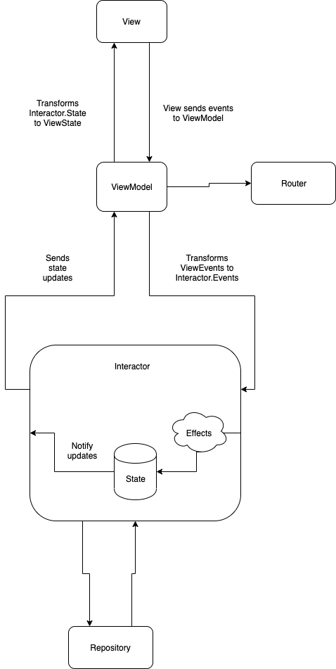

# Clean Architecture using RxSwift and unidirectional data flow

A demo project showcasing the setup of an app with Clean Archicture using RxSwift and unidirectional data flow. This architecture features an independent presentation layer so there are no redundant values stored in the state and the view only receives the elements it needs.

The ViewModel and Interactor are fully tested with all the power of RxTest

## Data flow

1. The view sends events related to the view to the view model. In this example: 
    1. viewDidLoad
    2. The user taps a button, then the view sends the didTapButton event to the view model

2. The ViewModel transforms the view events to interactor events. For example: 
    1. Transforms the CountViewEvent.viewDidLoad to CountEvent.load
    2. Transforms the CountViewEvent.didTapButton to CountEvent.incrementCount

3. The interactor process the events, creates async tasks if necessary and then perform effects. The effects modify the state. For example:
    1. CountEvent.load triggers to load the previous count asynchronously from the repository. When the previous count is loaded an effect modifies the state by setting the previous value in the state.
    2. CountEvent.incrementCount triggers an effect that stores the value in the repository and then in the state

4. The view model receives the state update and transforms the CountState found in the interactor to a formatted view state ready to be consumed by the view. The view state should not include any piece of information found in the interactor state that is not necessary for the view. In our example it formats the count integer to a string

5. The view receives and renders the new state. In this case if the formatted count string is different from the one it has it updates the UILabel

